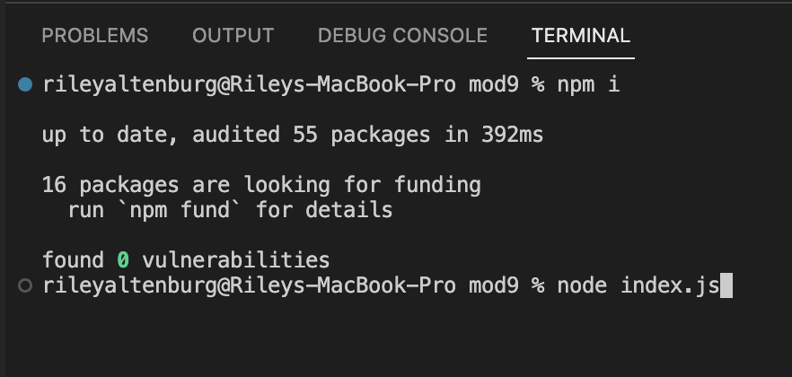
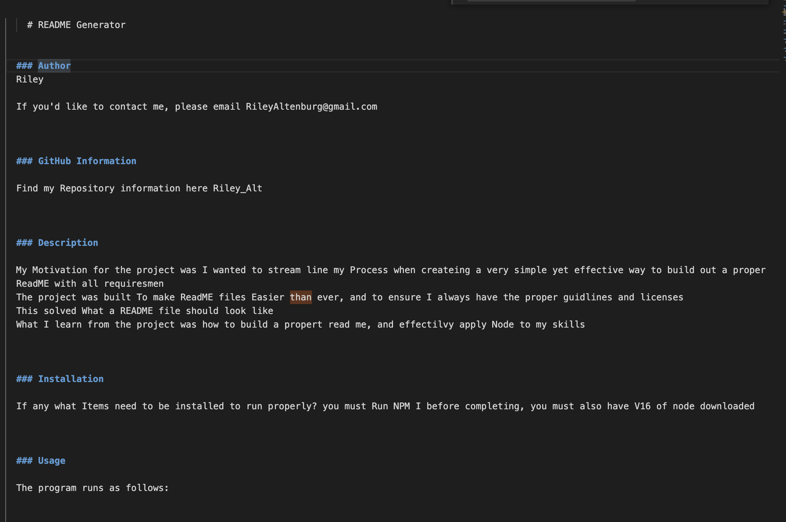

<!-- # Professional README Generator Starter Code

[How to create a Professional README](https://coding-boot-camp.github.io/full-stack/github/professional-readme-guide) -->

# README Generator

### Author

Riley Altenburg

If you'd like to contact me, please email RileyAltenburg@gmail.com

### GitHub Information

Find my Repository information here at: https://github.com/RileyAlt/Readme-Generator

### Description

My Motivation for the project was I wanted to stream line my Process when createing a very simple yet effective way to build out a proper ReadME with all requiresmen
The project was built To make ReadME files easier than ever, and to ensure I always have the proper guidlines and licenses
This solved What a README file should look like
What I learn from the project was how to build a propert read me, and effectilvy apply Node to my skills

## Table of Contents

- [Installation](#installation)
- [Usage](#usage)
- [License](#license)

  ### Installation

  If any what Items need to be installed to run properly? You must Run NPM Install or (NPM I) before starting your testing, you must also have V16 of node downloaded. onto your computer

  ### Usage

  The program runs as follows:

### Licensing

MIT

### Contributors

None

### Testing
